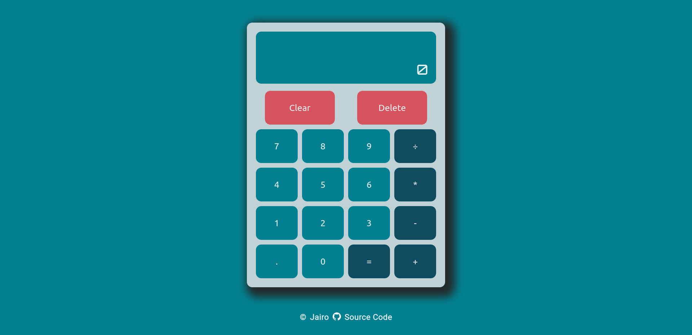

    
    <h1>Calculator </h1>
    
For simple calculations

    

        <a href="https://jotafer19.github.io/calculator">View Demo</a> · 
        <a href="https://github.com/jotafer19/calculator/issues">Report Bug</a> ·
        <a href="https://github.com/jotafer19/calculator/issues"> Request Feature</a>
    

## Preview

### Features

- A Simple Calculator which is built with Modern Javascript practices.
- It can evaluate expressions for addition, subtraction, multiplication and division.
- Clean UI for better visuals.

### Built With

-    
-    
- 

### Tools Used

- 
-   
- 

## Usage

- 

For Mobile

  - ### General
    - Click the visual buttons to use Calculator.

- 

For Desktop

  - ### General
    - You can also click visual buttons for access
    - Refer additional information below.
  - ### Additional 
    - `Keyboard Supported`
    - `0-9 Keys`: Takes input for numbers.
    - `Operation Keys`: Operates with operands.
    - `Backspace Key`: Deletes a digit.
    - `Enter Key`: Shows the result.
    - `Esc Key`:  Clears the display.

## Outcome

* Used HTML5 **semantic elements** for better readability and structure.
* Used CSS3 **grid** and **flex** to manage layout.
* Used **Data-Attributes** for accessing DOM Elements.
* Used **Git** and **GitHub** for project management.
* Tried to maintain **clean code**.

## What I learned

* Better knowledge and it's practical usability of **Javascript**.
* Learned to add **keyboard support** with event listeners.
* A lot of minor things.

## Acknowledgments

* Inspiration by [**The Odin Project**](https://www.theodinproject.com/lessons/foundations-calculator).
